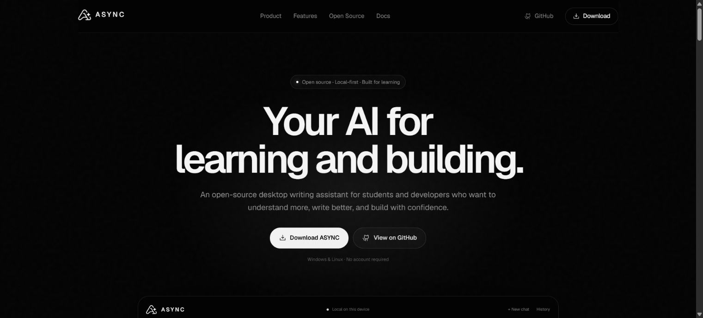

<p align="center">
  <picture>
    <source media="(prefers-color-scheme: dark)" srcset="public/async-logo-dark.svg">
    <source media="(prefers-color-scheme: light)" srcset="public/async-logo-light.svg">
    
  </picture>
</p>

<h1 align="center">ASYNC</h1>

<p align="center">
  Open-source desktop writing assistant for students and developers.
</p>

<p align="center">
  <strong>Write better. Learn faster. Build smarter.</strong>
</p>

<p align="center">
  
</p>

<p align="center">
  <a href="https://github.com/pedrotescaro/async/releases">Download</a>
  ·
  <a href="#development">Development</a>
  ·
  <a href="CONTRIBUTING.md">Contributing</a>
</p>

ASYNC is a local-first desktop assistant that combines writing help, technical tutoring, study tools, code review, debugging, translation, and local Markdown notes in one fast interface. The user sees one product — ASYNC — without provider pickers or API key forms. The desktop model menu can select models already installed in the local runtime without exposing its URL or credentials to the renderer.

> The repository currently contains the first functional MVP architecture. Runtime installation is not silently automated yet: ASYNC detects an existing local runtime, can start it, download the base model, create the logical `async` model, stream responses, and expose technical details only in Diagnostics.

## Product principles

- **Teaching first.** In educational contexts, ASYNC explains concepts and provides useful hints before taking over.
- **One native intelligence boundary.** The renderer can request a sanitized local model name, effort, and speed, but never knows the runtime URL or calls the provider directly.
- **Local-first.** Notes, chat history, app settings, and AI runtime state are distinct local data domains.
- **Fast by default.** The Electron main process streams generation without blocking the renderer and supports cancellation.
- **Honest by design.** ASYNC never claims code was executed or tests passed without real evidence.
- **Monochrome identity.** The visual system uses only black, white, and neutral tones.

## Features

- Chat with streaming Markdown responses, syntax highlighting, code copy, smart scroll, attachments, stop generation, and contextual follow-ups.
- Desktop model, effort, and speed controls backed by the models installed in the local runtime.
- Voice input through Chromium speech recognition when available, with automatic system-language mode plus Portuguese, English, Spanish, French, German, and Italian choices.
- Native maximize/restore and full-screen controls in the frameless Electron window.
- Context-aware suggestions for text, code, Markdown, documentation, errors, and stack traces.
- Structured writing transformations with original/result comparison, change reasons, confidence, copy, retry, replace, and **Ask why**.
- Local Markdown notes with create, edit, search, pin, delete, and send-to-ASYNC actions.
- Local conversation history with search, rename, pin, delete, and continue.
- Global `Ctrl+Alt+A` shortcut, system tray, close-to-tray behavior, and internal `Ctrl+K` command palette.
- First-run setup flow, health checks, sanitized errors, and a technical Diagnostics screen.
- Responsive landing page with an automatic ASYNC chat demonstration.
- Windows NSIS and Linux AppImage/deb packaging configuration with GitHub Releases auto-update wiring.

## Local AI

The renderer talks only to a narrow preload bridge:

```text
React Renderer
      ↓ validated IPC
Electron Main
      ↓
AsyncEngine
      ↓
Local AI Runtime
      ↓
logical model: async
```

The default development runtime uses the included [`ai/Modelfile`](ai/Modelfile). Its base model remains an implementation detail behind the automatic ASYNC choice, while advanced desktop users can explicitly choose another model that is already installed. The runtime URL and logical default model can be overridden through main-process-only environment values in [`.env.example`](.env.example).

On startup, ASYNC warms the default model in the background and keeps it loaded for 30 minutes. Simple requests use a compact prompt and a smaller context/answer budget; code review, debugging, large context, or high effort keep the deeper profile.

## Download

Tagged releases are prepared for:

- Windows x64 — NSIS installer (`.exe`)
- Linux x64 — AppImage and Debian package (`.deb`)

Published builds will be available on [GitHub Releases](https://github.com/pedrotescaro/async/releases). The release workflow generates GitHub build-provenance attestations for release binaries and supports Authenticode code signing when credentials are configured.

Maintainers can configure signing credentials by following the [Windows code-signing guide](docs/code-signing.md).

## Installation

Requirements for the current MVP:

- [Bun](https://bun.sh/) 1.3 or newer
- Windows 10/11 or a modern Linux desktop
- A compatible local AI runtime for chat/setup testing

```bash
git clone https://github.com/pedrotescaro/async.git
cd async
bun install
bun run ai:pull
bun run ai:create
bun run dev
```

The desktop setup screen can perform the pull/create steps when the runtime executable is already installed and reachable.

## Development

```bash
# Electron desktop app
bun run dev:desktop

# Landing page only
bun run dev:site

# Quality gates
bun run typecheck
bun run lint
bun run test
bun run build
```

## Architecture

```text
src/                    React desktop renderer
  components/           chat, writing, notes, history, settings, setup
  lib/                  shared contracts and context detection
electron/
  main/                 window, tray, lifecycle
  preload/              narrow context-isolated bridge
  ipc/                  channel registration and sender authorization
  services/
    ai/                  AsyncEngine, runtime setup, prompts, errors
    storage/             settings, Markdown notes, chat history
    shortcuts/           configurable global shortcut
    selection/           explicit cross-platform capture boundary
    updater/             GitHub Releases update checks
ai/                     Modelfile and specialized prompt files
landing/                independent responsive product site
```

See [Architecture](docs/architecture.md) and [Privacy model](docs/privacy.md) for implementation details and current limitations.

## Keyboard shortcuts

| Shortcut | Action |
| --- | --- |
| `Ctrl + Alt + A` | Open ASYNC and offer current clipboard text as context |
| `Esc` | Close a dialog, go back, or hide ASYNC |
| `Ctrl + Enter` / `Enter` | Send (the composer uses `Enter`; `Shift+Enter` adds a line) |
| `Ctrl + N` | Start a new chat |
| `Ctrl + K` | Open the command palette |
| `F11` | Enter or leave full-screen mode |

Electron does not expose another application's active selection reliably on every supported platform. The current adapter reads the clipboard at shortcut time; native per-platform selection adapters can be added behind the same boundary without changing the renderer.

## Roadmap

- Signed runtime bootstrapper and installer-managed local engine.
- Native selection capture adapters for Windows and Linux/X11.
- Import/export for notes and chat history.
- Richer study artifacts: flashcard decks and quiz sessions.
- Smarter automatic routing across multiple installed local model sizes behind the stable `AsyncEngine` contract.
- macOS packaging, signing, and notarization.

## Inspiration and provenance

ASYNC studied [Polire](https://github.com/joao-gugel/polire) for desktop product patterns such as tray behavior, global shortcuts, local notes, IPC boundaries, and release preparation. It uses the official ASYNC branding and educational principles from [Stacklyst](https://github.com/pedrotescaro/Stacklyst). It is a new implementation with its own product scope, architecture, prompts, and visual system.

## Contributing

Focused issues and pull requests are welcome. Read [CONTRIBUTING.md](CONTRIBUTING.md) before opening a change.

## License

ASYNC is available under the [MIT License](LICENSE).
